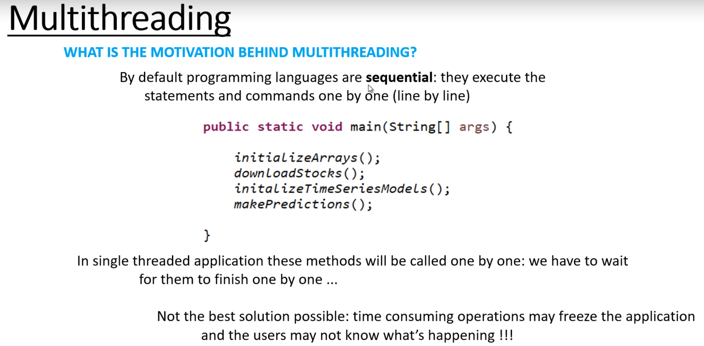
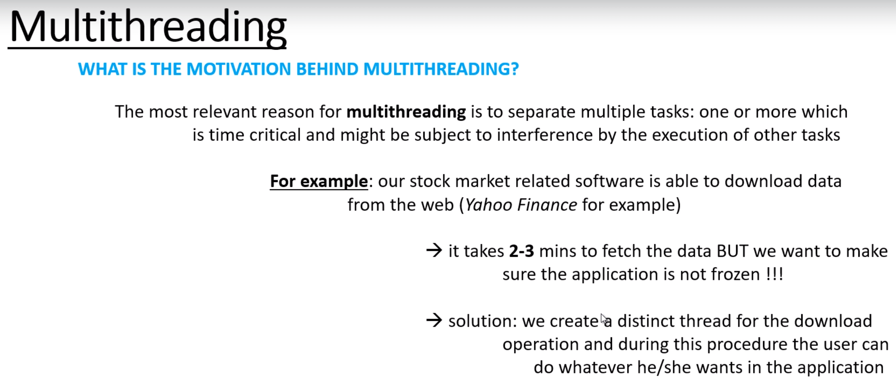
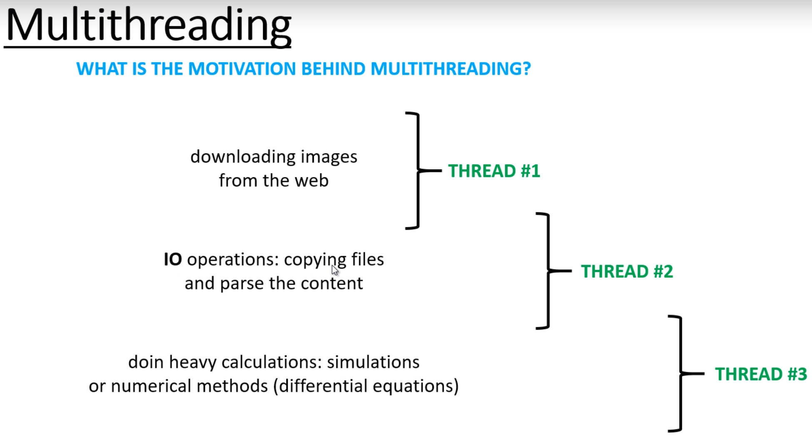
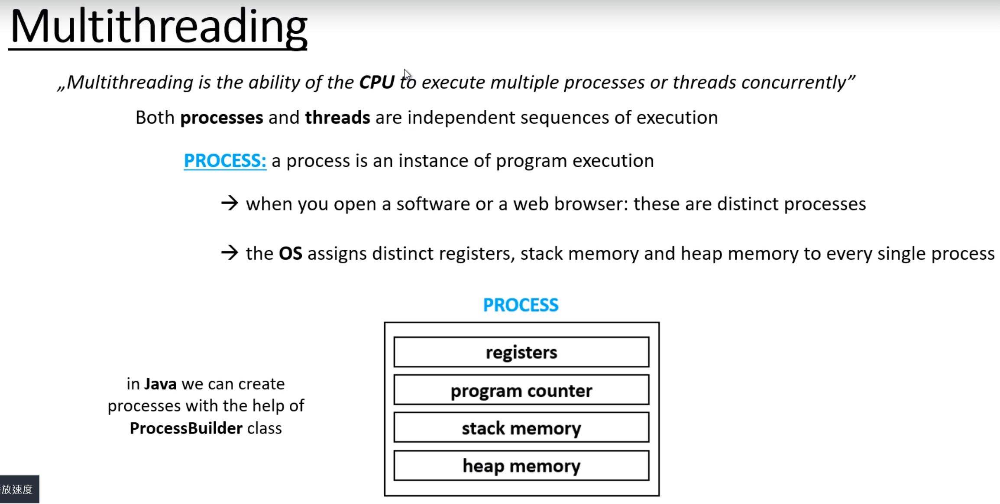
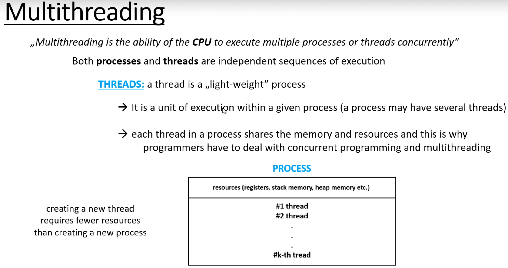

# 2. Processes and threads introduction

## 為什麼要多執行緒?

一般來說，程式是逐行執行的，所以如果某一行程式要執行很久，下一行就會遲遲不開始

使用多執行緒，可以同時做多件事。比方說在背景拉API，然後可以繼續操作其他事。

**多線程代表CPU有同時執行多進程(process)或線程(thread)的能力**

進程 : 
程序執行的實體
- 一個軟體, 如瀏覽器, 就是一個進程, 開工作管理員就可以看到很多進程

線程 :
- 輕量化的進程
- 一個進程至少有一個線程, 如果只有一個線程, 則為單線程
- 一個標準的線程組成主要會有：
  - Thread ID
  - Programming Counter
  - CPU registers
  - stack
其實和進程差不多, 所以是輕量化的

