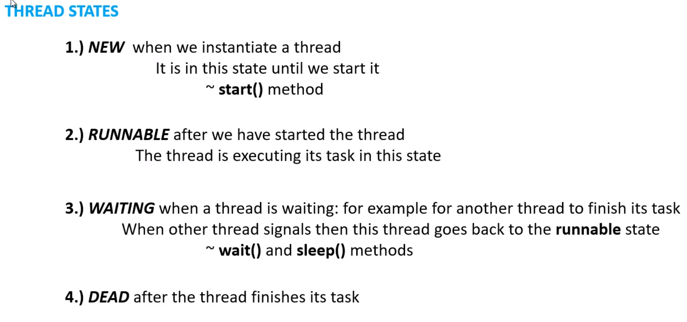

# 6. Thread life cycle in Java

生命週期 :

1. NEW : 當thread被初始化時, 會進入 NEW state; 當呼叫 start() 方法時, 會進入RUNNABLE state
2. RUNNABLE : 執行主要程式
3. WAITING : 線程正在等待時, 會從RUNNABLE變成 WAITING狀態, 當等待結束後會再回到RUNNABLE狀態, 呼叫wait()或sleep()都會使其進入WAITING狀態
4. DEAD : 線程完成任務，進入DEAD

- NEW -> RUNNABLE
- RUNNABLE可以變成WAITING，WAITING可以變成RUNNABLE
- DEAD : 一旦進入就不會再回去RUNNABLE或WAITING