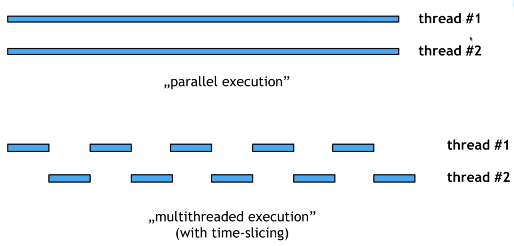

# 8. Starting threads - Runnable



[範例](/sourcecode/src/main/java/_8/Main.java)

```java
Thread t1 = new Thread(new Runner1());
    Thread t2 = new Thread(new Runner2());
    t1.start();
    t2.start();
```

**以上的寫法並不是調用了兩個CPU核心, 而是一個單核並用 time-slicing的方法來做多線程任務。**


