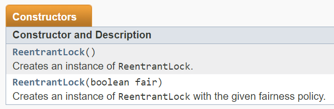
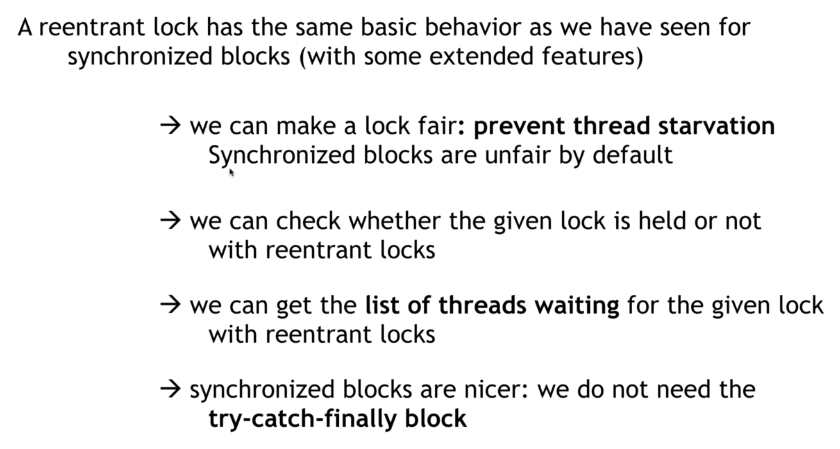

# 23. Locks and synchronization

## Lock的優勢

1. 更公平的使用 thread :
    對於 ReentrantLock 實作, 可以傳入一個布林參數
    如果傳入true, 則在await時會優先取最久沒被用到的thread來處理
    

    synchronized wait()則是隨機取一個thread
2. 可檢查鎖是否正在被其他的thread取用
3. 可以獲得正在等候的thread 名單
4. 不需要try-catch block

