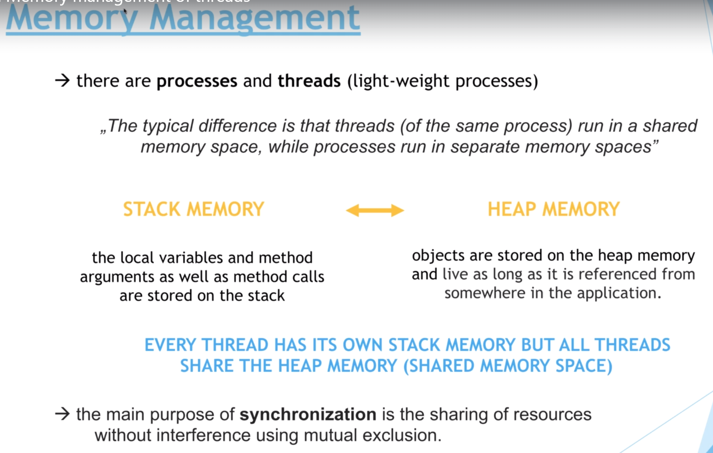

# 13. Memory management of threads

- Thread : 在共用的記憶體空間執行, 需要記憶體管理及同步
- Process : 在獨有的記憶體空間執行, 因此不需要記憶體管理

## 兩種記憶體

- Stack Memory(快, 小)
  - 歸類
    - primitive variables(八大基本類型)
    - object reference(物件引用)
    - 參數(參數只會是上面兩種型態, 大概吧?)
  - 當方法結束時, 代表stack生命週期結束, 會釋放出記憶體
- Heap Memory(慢, 大)
  - 物件實體, 包括物件內部的方法 / 變數
  - 物件在沒有被引用時, 會被Garbage collector回收
  - 當process結束時, Heap memory 被釋放

**每個線程都有自己的stack memory , 但共用同一個heap memory**

