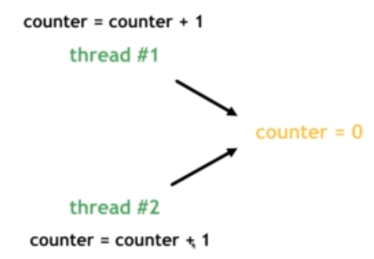
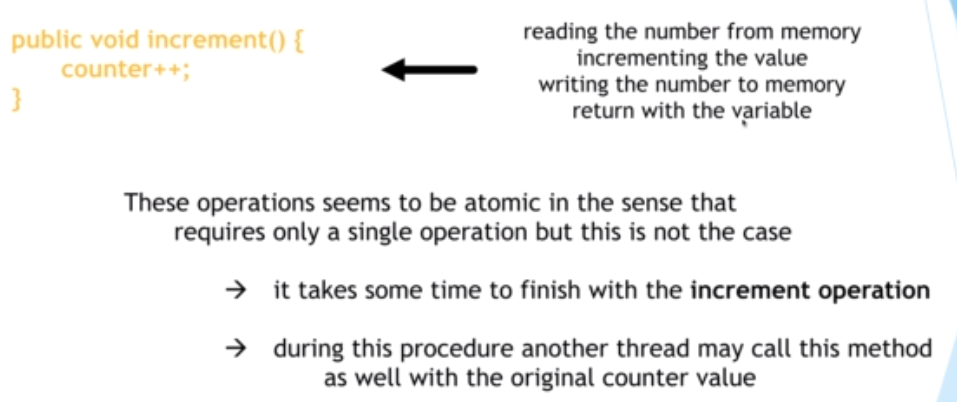

# 14. Synchronization

接續上章學到的 : 存在 Heap memory 的變數是可以被所有執行緒共用的。

因此, 當多個執行緒修改同一個Heap上的變數的時候，比如說heap中有個變數 counter = 0

兩個執行緒會對他加1。

加1的動作，其實可以細分成 :

1. 向heap取得這個變數 (讀)
2. 修改值 (改)
3. 將變數存回heap memory 中 (寫)

[無sync原始碼](/sourcecode/src/main/java/_14/WithoutSync.java)

1. 兩線程都向 heap 取 counter值, 同一時間操作, 剛好都取到0
2. 兩線程都向取到的 counter 進行 +1 的動作, counter都變成 1

3. 最後, 線程各自將counter寫回heap

[sync原始碼](/sourcecode/src/main/java/_14/WithSync.java)
