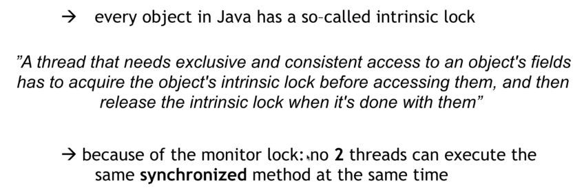
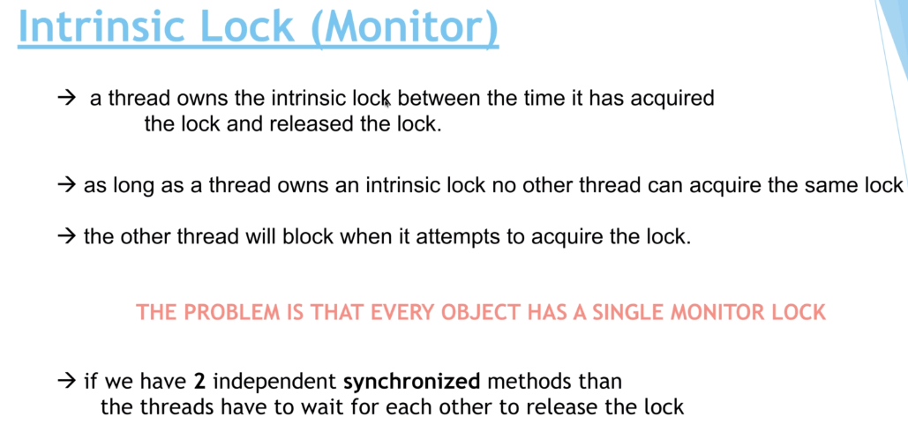

# 15. Problems with synchronization


一旦方法被加上 `synchronized` 關鍵字, 代表該方法在同時只能被一個線程存取

- 所有的Java物件都有 intrinsic lock(又叫 Monitor lock)。
- 如果有一個線程想要存取一個 Java 物件, 則需要先取得 intrinsic lock。
- 在線程完成之後, 需要釋放 intrinsic lock。

### 代碼解釋 :

```java
public class App {

  public static int counter = 0;

  public static synchronized void increment() {
    counter++;
  }

  public static void process() {
    Thread t1 = new Thread(new Runnable() {
      @Override
      public void run() {
        for (int i = 0; i < 10000; i++) {
          increment();
        }
      }
    });
    Thread t2 = new Thread(new Runnable() {
      @Override
      public void run() {
        for (int i = 0; i < 10000; i++) {
          increment();
        }
      }
    });
  }

  public static void main(String[] args) {
    process();
  }
}
```
上面的代碼中 , process() 中有兩個線程 : t1 / t2。當線程要執行 increment 方法的時候, 它會向 class `App` 取 `intrinsic lock`。
而如果 t1 取得了 lock, 則在它釋放掉 lock 之前, t2 是不能取得 lock 的。

這也就保證了多線程不會同時修改到同一變數。







