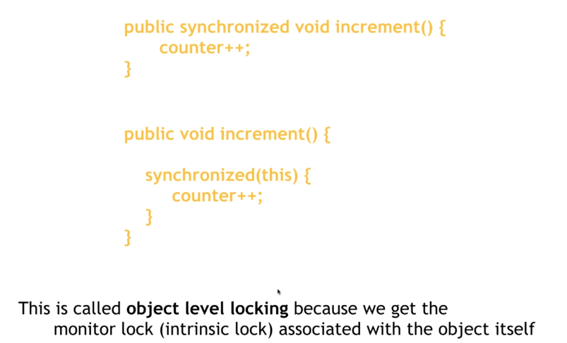
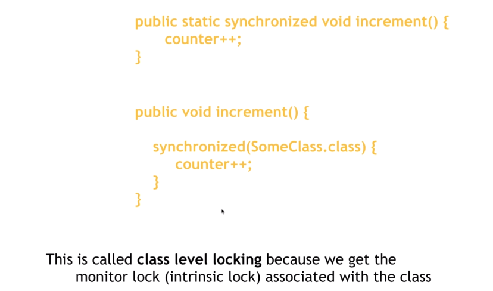

# 15.2 object level vs class level locking


- Object level locking


方法被定義成**非靜態**, 因此 intrinsic lock 是由 object 提供

- Class level locking



方法被定義成**靜態**, 因此 intrinsic lock 是由 class 提供

靜態方法沒有辦用 `this`


## 通常不建議在方法上寫 synchronized 關鍵字

盡量在方法裡面寫

```java
// 非靜態
public void increment() {
    synchronized(this) { // object level locking
        counter++;
    }
}
```

```java
// 靜態
public static void increment() {
    synchronized(App.class) { //  class level locking
        counter++;
    }
}
```

原因是 : 盡量只對100%需要用synchronized的部份做同步化操作。

如果是在方法下關鍵字, 則整個方法都會是同步的。

[優化版本](/sourcecode/src/main/java/_15/AppBetterVersion.java)
