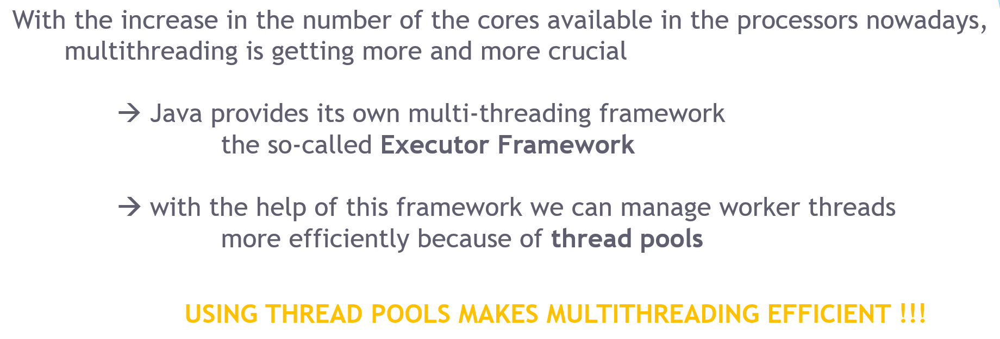
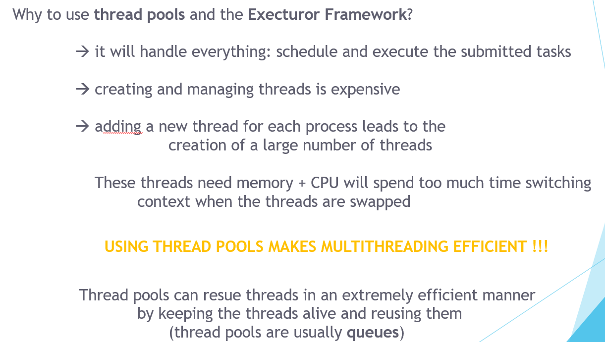

#　34. Why to use thread pools?

電腦核心越來越多，因此Java提供了 Executor framework

Executor framework 可以用 `thread pool` 方便管理 thread, 方便且有效率。

- 方便

Thread pool 管理所有線程，不需要手動處理。

- 有效率

手動建立及管理 Thread 是昂貴的。

各線程需要記憶體和CPU ，來切換 context。

## Executor

Executor可以用有效率的方式來回收再利用線程，已經用完的線程不一定會直接結束，而是指派另一個工作。

整個過程自動處理 ! 痛點解決。

### 為什麼建立 Thread 是昂貴的?

- Java 需要指派記憶體空間給 thread stack 
- 新的記憶體需要有 cache 和相關聯的 CPU 被指派。

## 4種Executor

### SingleThreadExecutor

該 executor 只會同時存在一個線程，所以執行程序會以順序的方式執行。

每個進程都是由一個新的線程執行。

### FixedThreadPool(n)

可以有 n 個線程， n 通常是電腦的核心數。

如果 任務數量 > n ，則任務會存在 `LinkedBlockingQueue` 

### CachedThreadPool

不指定線程數量，如果任務數量多於Thread Pool 線程數量，則建立一個新的Thread。

- 預設線程超過60秒沒人使用，就移除掉
- 通常用於平行任務

### ScheduledExecutor

可以設定執行區間，或執行延遲時間
