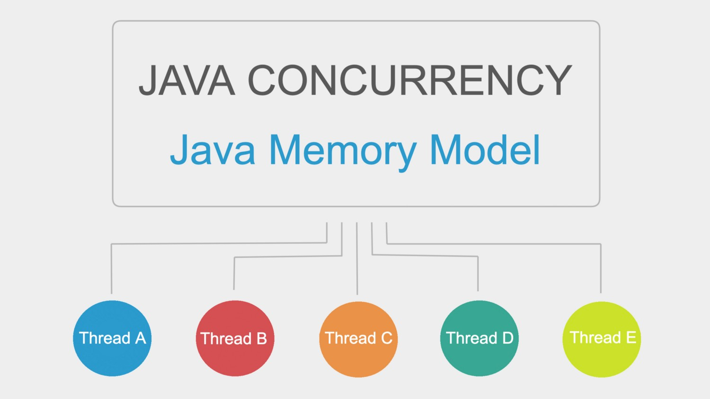
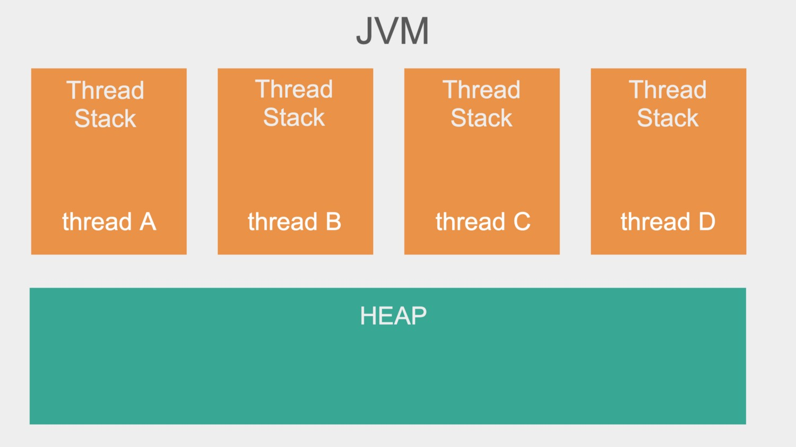
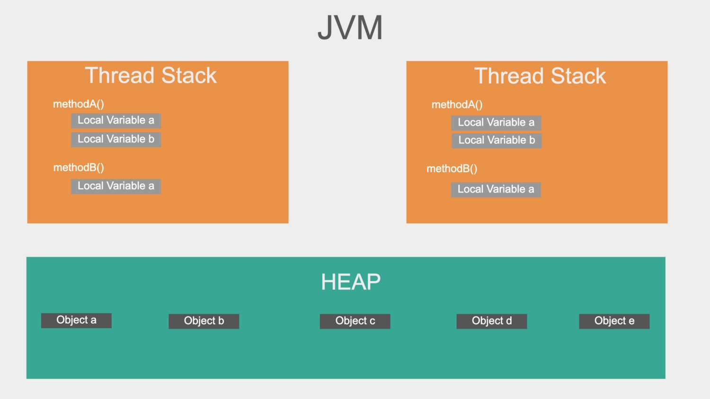
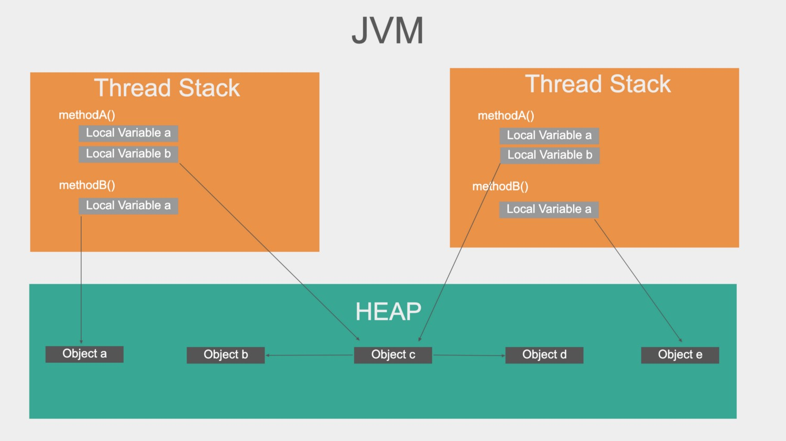
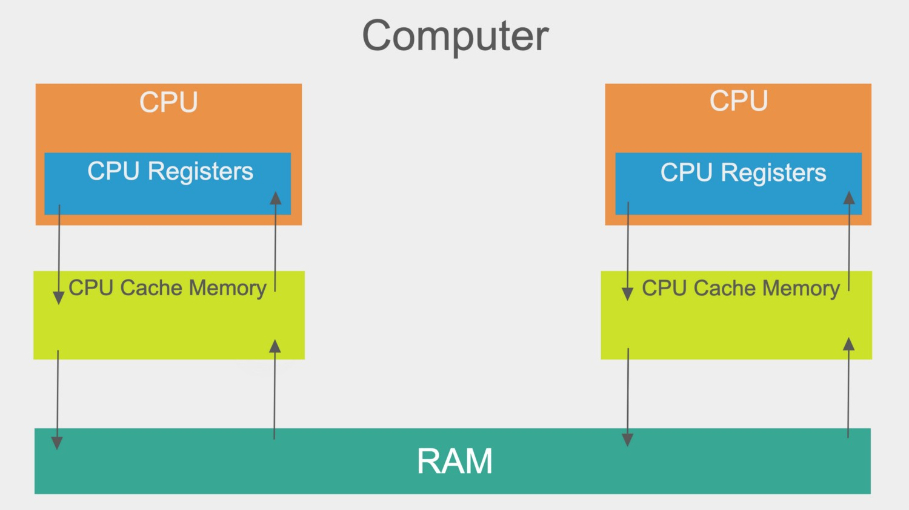
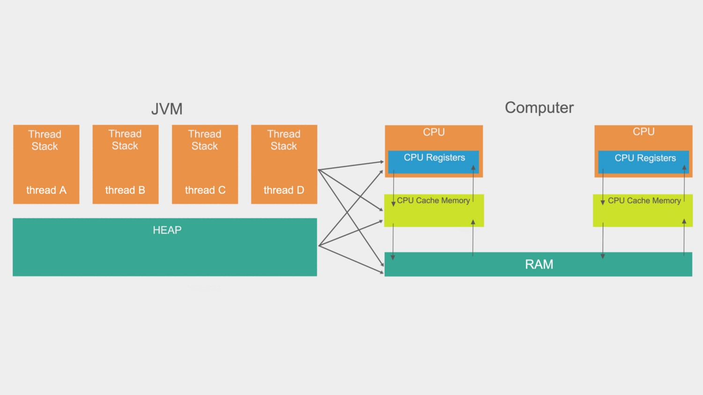
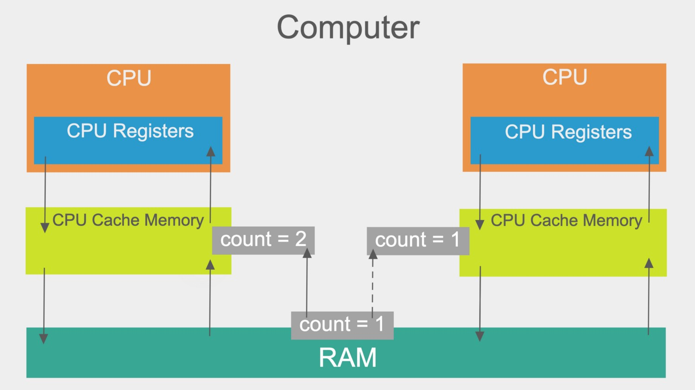
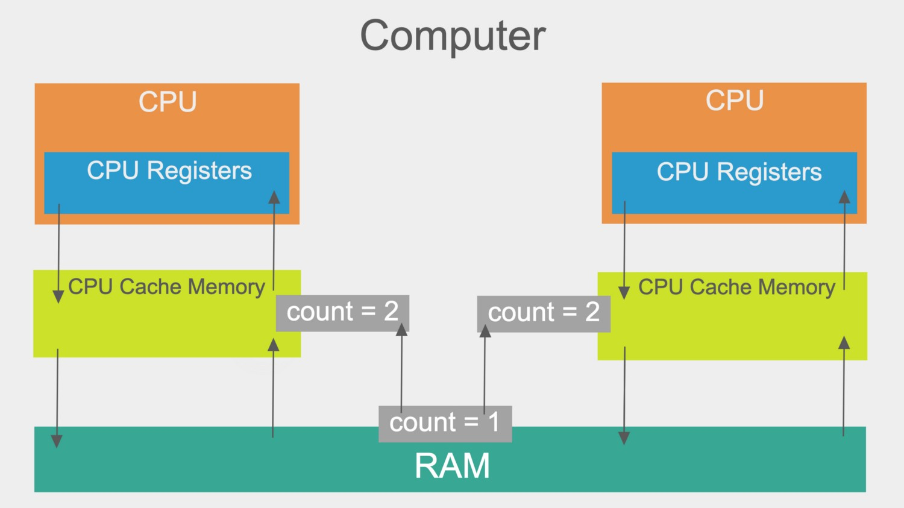

# Java 記憶體模型

> This article is transformed and summarized from [Java Concurrency: Java Memory Model](https://medium.com/javarevisited/java-concurrency-java-memory-model-96e3ac36ec6b)



## Java 內部記憶體模型
JVM 內部的記憶體模型大致被分為兩大部份 :
1. 線程 Stack (橘色)
2. Heap (青色)



### Thread

每個線程都有各自的Stack，裡面包含以下資訊 :
1. 本線程呼叫了什麼方法，當前執行到哪裡
2. 區域變數
   1. 八大基本型別 : 會把值一同存在 stack 上
   2. 物件 : 會存物件的 reference。 reference 也算是區域變數。

線程的區域變數是獨立於其他線程的，因此不能存取其他線程的區域變數。

### Heap

Heap 是共用的記憶體空間，通常空間大小大於 Stack, 存取速度較慢

包含 :
- member variable
- 物件實體

一個物件在 new 出來時，會有一個 reference counter，相當於該物件被引用的，相當於該物件被引用的計數器。一旦該數字歸零，則Garbage collector被啟動時，該物件被回收，記憶體空間被釋放出來。



### 複雜的部份 : 物件

Java物件包含屬性(member variable)和方法(member method)。

- 屬性

物件屬性又稱為成員變數。成員變數不論是基本型別還是物件，不論是reference還是value, 都是存在Heap中。

- 方法

方法又稱為成員方法(非靜態方法)。方法裡面的八大基本型別是放在 stack 的。我想也可以說，成員方法本身可以當成一個 thread stack 來看待。

- 靜態變數

不意外的存在 Heap 中。

### 為什麼這些這麼重要?

只要 thread 有 object reference，就有機會存取該 object，而 Heap memory 是所有線程共用的。

一個 object 上存在 heap 的資料，都可以被任意線程存取。要是同時存取並修改該資料，就有可能發生異常。



上圖中，左線程可存取物件a 和物件 c。

而雖然該線程沒有直接存取物件 b, 但是物件 c 有向物件 b 的引用。所以該線程可以透過物件 b 存取物件 c。


## 硬體架構



上圖為一2核心CPU電腦。

多核心，代表「可以」同時有多線程。

每個核心「可以」有一個線程。

> 「可以」代表「至少可以」

如果 Java 程式是多線程的，代表 CPU 上的線程可以「同時」在工作。

> 「同時」不代表「平行運算」

### 寄存器(register)
- 每個CPU上有一組寄存器，這對 in-CPU memory 是必要的。
- CPU 在寄存器上的操作會比在主記憶體上更快，因為CPU存取在寄存器上的變數比向主記憶體更快。

### CPU 快取記憶體

- 存取速度 : 寄存器 > 快取記憶體 > RAM

### RAM

- 主記憶體位置，所有CPU都可以存取RAM。
- 通常比上面兩個都要大得多。


### 工作流程

如果 CPU 需要向 RAM 要一個變數來計算，算完之後存回 RAM，流程是 :

1. 快取記憶體讀取 RAM 上需要的資料
2. 寄存器讀取快取記憶體上的部份資料
3. 運算
4. 刷新(flush)結果至快取記憶體
5. 刷新(flush)結果至 RAM

```
看不太懂
The values stored in the cache memory is typically flushed back to the RAM when the CPU needs to store something else in the cache memory. The CPU cache can have data written to a part of its memory at a time and flush part of its memory at a time. It does not have to read/write the full cache each time it is updated. Typically the cache is updated in smaller memory blocks called “cache lines”. One or more cache lines may be read into the cache memory, and one or more cache lines may be flushed back to the RAM again.
```

## Java Memory Model and Hardware

兩者的架構不同。

硬體方面，並沒有區分 stack 和 heap。大部份 stack 和 heap 資料都在主記憶體；一小部份則在 CPU cache 和 CPU register 中。參考下圖。



當物件和變數可以被存在記憶體中的不同位置時，會有兩個主要的問題

1. 共享物件能見度 : 不同線程可能同時存取同一物件。
2. 競態條件

### 共享物件能見度(Visibility Of Shared Objects) 

上面已經講過基本的CPU寫入RAM數值的過程。

在多線程的環境下，當某一CPU線程讀入RAM上的變數到 cache memory 時, 並不會立馬計算完成並刷新值回 RAM。

此時如果另一線程也跑來讀這個值，那麼讀到的會是還沒有被改變的值。

兩個CPU cache 上都有這個值的原始 copy，最後經過計算後再刷新回 RAM。

最終後者的線程使用的值會有可能不是當前主記憶體的值。



要解決，必須要使用 `volatile` 關鍵字，確保每次CPU計算取值都是向主記憶體來拿。

### 競態條件

跟上個問題很像，只是問題延伸到如果兩個線程同時更新一個變數，可能會導致兩次計算卻只有一次更新。



解決 : `synchronized` 關鍵字或其他同步技術。


